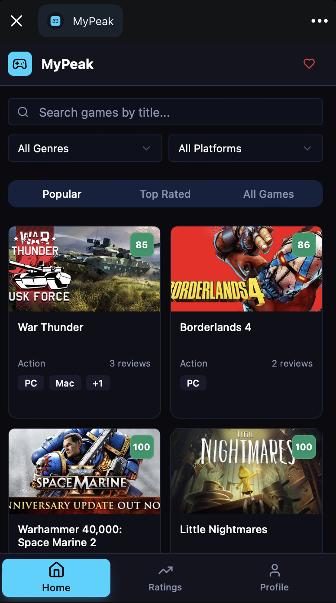
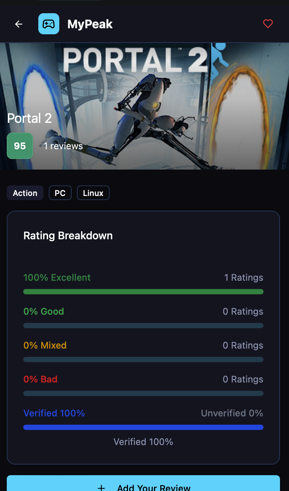
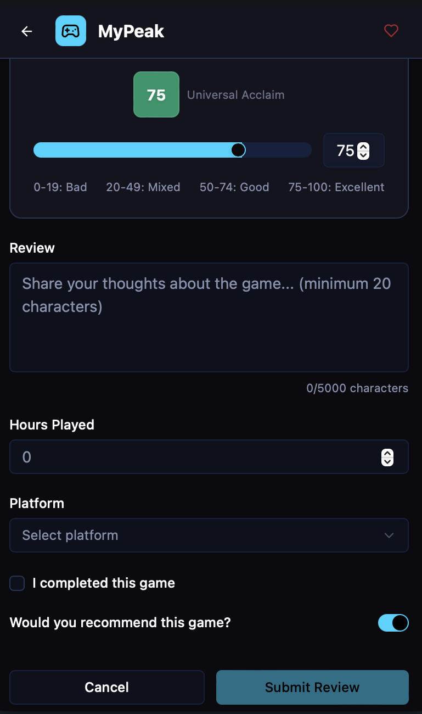
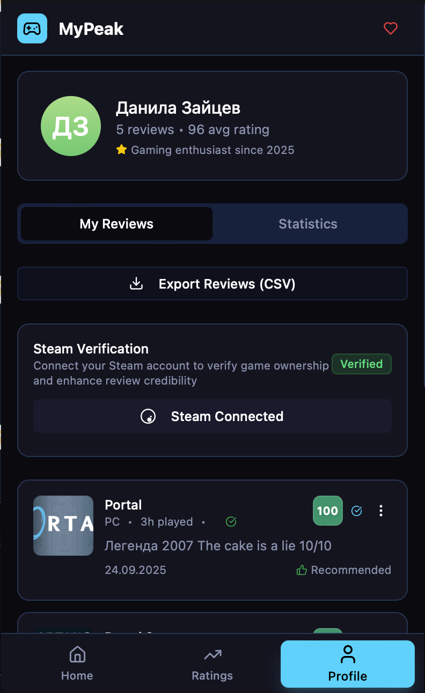

# MyPeak 🏔️

**Прозрачный аналог Metacritic с верификацией Steam в Telegram Mini App**

🚀 **Бот в telegram**: [t.me/mypeak_bot](https://t.me/mypeak_bot)  

## О проекте

MyPeak — это полностью прозрачный агрегатор отзывов на игры с акцентом на объективность.  
Главная фича — **взвешенный рейтинг** и **верификация владения игрой в Steam** (вес отзыва ×10).

Проект написан с нуля как full-stack pet-проект для демонстрации enterprise-уровня Java-разработки.

## Ключевые фичи

- Аутентификация через Telegram Login (HMAC SHA-256 валидация initData + replay-protection)
- JWT + Spring Security (stateless)
- OpenID авторизация Steam + проверка владения игрой через GetOwnedGames API
- Взвешенный рейтинг с формулой (длина текста + часы + завершение + верификация ×10)
- Race-condition защита: `@Transactional` + `PESSIMISTIC_WRITE` locks
- Rate limiting через Bucket4j (100 req/min)
- Санитизация ввода (Jsoup), CSP заголовки
- UniqueConstraint на отзыв (user + game) — нельзя дублировать
- EntityGraph + batch_size=50 + индексы для оптимизации запросов
- Полное покрытие тестами (JUnit 5 + Spring Test + Mockito)
- Telegram LongPollingBot (/start мультиязык, /donate Stars, /support с фото админу)

## Стек

**Backend**
- Java 21
- Spring Boot 3.3 (Web, Data JPA, Security, Validation)
- PostgreSQL 16
- Hibernate + JPA
- JJWT, Bucket4j, Jsoup
- Telegram Bots Spring Boot Starter

**Frontend (Telegram WebApp)**
- React 18 + Vite
- Tailwind CSS + shadcn/ui
- Framer Motion анимации

**Инфраструктура**
- VPS деплой (JAR + PostgreSQL)
- Gradle
- Ngrok для dev/webhook

## Скриншоты

